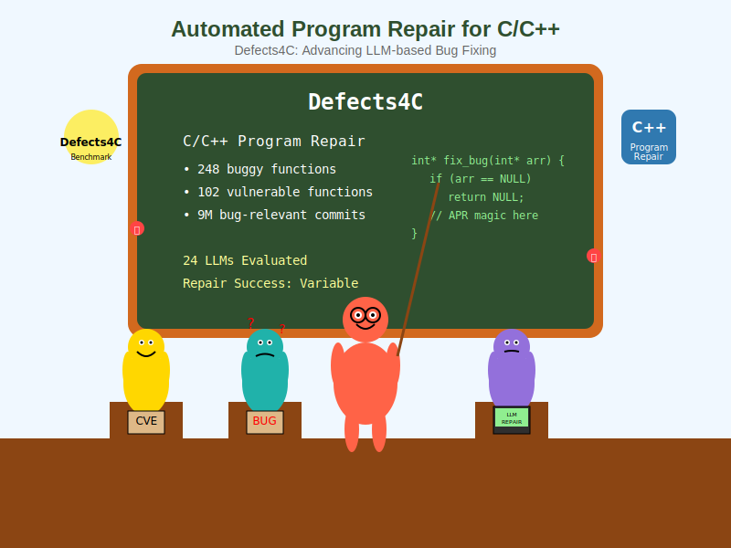
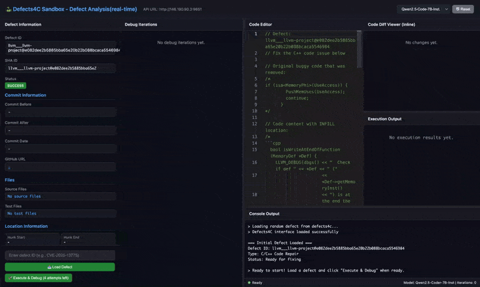

# Defects4C
## Defects4C: Benchmarking Large Language Model Repair Capability with C/C++ Bugs 👋



### ⚠️ Online platform update

We are updating the [online platform](https://defects4c.github.io/python_sandbox.html).

You do **not** need to install or deploy the Docker container locally if you only want to try the benchmark. You can directly call the API using [`http_tutorial.py`](https://github.com/defects4c/defects4c/blob/master/http_tutorial.py) to test your LLM results.

At the moment, the online platform supports **pass@1** evaluation for each defect. If you want to evaluate **pass@k > 1**, you will need to deploy the system locally, since our online computation budget is limited.

<video width="640" height="360" controls>
  <source src="assets/videos/record-video.webm" type="video/webm">
  Your browser does not support the video tag.
</video>



Most existing Automated Program Repair (APR) research focuses on Java programs, mainly through Defects4J. Although C/C++ vulnerabilities are widespread and important, research on automated repair for C/C++ remains limited.

To help fill this gap, we introduce **Defects4C**, a high-quality executable benchmark for C/C++ defects. It contains **248** buggy functions and **102** vulnerable functions, together with test cases for reproduction.

## Evaluation Scenarios

To assess the effectiveness of state-of-the-art APR techniques on C/C++ faults, we conduct a comprehensive empirical study on Defects4C using 24 state-of-the-art LLMs in two settings:

- single-round repair
- conversation-based repair

## Local deployment

This section shows how to prepare the Docker environment and run the benchmark locally.

## What this setup does

This setup will:

- build the Docker image
- start a container
- clone the benchmark repositories into `/out`
- run a warmup step
- run the tutorial script

## Before you start

Make sure you have enough disk space before cloning the repositories.

- about **20 minutes** for cloning
- about **80 GB** of disk space

<details>
<summary><strong>Docker setup</strong></summary>

## Step 1: Build the Docker image

```bash
docker image build -t base/defect4c .
````

## Step 2: Run the container

```bash
docker run -d \
  --name my_defects4c \
  --ipc=host \
  --cap-add SYS_PTRACE \
  -p 11111:80 \
  -v "`pwd`/defectsc_tpl:/src" \
  -v "`pwd`/out_tmp_dirs:/out" \
  -v "`pwd`/patche_dirs:/patches" \
  -v "`pwd`/LLM_Defects4C:/src2" \
  base/defect4c:latest
```

Port `11111` on the host is mapped to port `80` in the container. You can change this mapping as needed and update `http_tutorial.py` accordingly.

## Step 3: Download the mini repositories

This downloads the benchmark repositories, except LLVM. The downloaded data will take about **80 GB** under `out_tmp_dirs`.

```bash
docker exec my_defects4c bash -lc 'cd /src && bash bulk_git_clone_v2.sh'
```

## Step 4: Run warmup

This step takes about **20 minutes**.

It runs `cmake` or `configure` so the projects are ready for reproduction.

```bash
docker exec my_defects4c bash -lc 'cd /src && bash run_warmup.sh 8'
```

### Optional: Enter the container

```bash
docker exec -it my_defects4c bash
```

</details>

## Tutorial

After the container is running, the repositories are cloned, and warmup is finished, choose one model provider and run `http_tutorial.py`.

By default, Defects4C uses our remote verification server. After Docker warmup is complete, update the endpoint in `http_tutorial.py` from `DEFECTS4C_BASE_URL = "https://defects4c.wj2ai.com"` to `DEFECTS4C_BASE_URL = "http://127.0.0.1:11111"` to use your local container.


### OpenAI

```bash
OPENAI_MODEL=gpt-4o-mini \
OPENAI_API_KEY="sk-xxx" \
OPENAI_BASE_URL="https://api.openai.com/v1/" \
python http_tutorial.py
```

### DeepSeek

```bash
OPENAI_MODEL=deepseek-chat \
OPENAI_API_KEY="sk-xxx" \
OPENAI_BASE_URL="https://api.deepseek.com" \
python http_tutorial.py
```

### Local OpenAI-compatible server

```bash
OPENAI_MODEL="Qwen/Qwen3-235B-A22B" \
OPENAI_API_KEY="sk-xxx" \
OPENAI_BASE_URL="http://127.0.0.1:8888/v1/" \
python http_tutorial.py
```

## API usage

More API examples and detailed usage refer to [`usage.md`](assets/http_api_usage.md).

## Notes

* Make sure the container is running before starting the tutorial.
* Make sure the repositories are cloned and the warmup step has finished before running `http_tutorial.py`.


## Citation


```bibtex
@INPROCEEDINGS{11334503,
  author={Wang, Jian and Xie, Xiaofei and Hu, Qiang and Liu, Shangqing and Yu, Jiongchi and Kong, Jiaolong and Li, Yi},
  booktitle={2025 40th IEEE/ACM International Conference on Automated Software Engineering (ASE)},
  title={Defects4C: Benchmarking Large Language Model Repair Capability with C/C++ Bugs},
  year={2025},
  pages={254-265},
  doi={10.1109/ASE63991.2025.00029}
}
````
